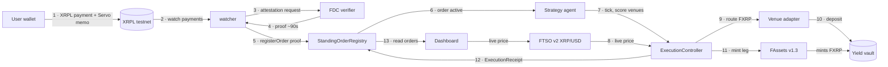

# Servo · Sign once. Your XRP works forever.


Servo is recurring money for XRP, built on Flare. One XRPL transaction turns
your wallet into a standing order: Flare Data Connector proves incoming XRP
payments on-chain, FAssets v1.3 mints them into FXRP, a strategy agent routes
the FXRP to the venue with the best realized yield (priced by FTSO v2), and
every execution leaves a verifiable on-chain receipt. One signature at setup.
One when the agent asks. Nothing else, ever.

## Architecture



Non-custodial end to end: the user's XRP/FXRP stays in their own wallet; the
agent can only propose; the only trust anchors are Flare's enshrined FDC +
FTSO v2.

## Target user

XRP holders who want their XRP working in DeFi without managing positions ·
DCA buyers, subscription/autopay users, and anyone leaving XRP idle in a
wallet. Flare's own research: 2B+ XRP sits dormant in Xaman; FXRP yield is
fragmented across 8+ venues and nobody watches it for you.

## Why Flare (the meaningful integration)

Servo is built on four enshrined Flare protocols · this is not a thin
wrapper:

| Protocol | Role in Servo |
|---|---|
| **FDC** | Every XRPL payment is proven on-chain via `verifyXRPPayment` against the FlareDataConnector before anything executes. No bridge, no trusted relayer claims · the payment IS the instruction. |
| **FAssets v1.3** | Direct minting turns a normal XRP send into FXRP (`AssetManager.executeDirectMinting`), so the standing order can fund itself from the XRPL side. |
| **FTSO v2** | `getFeedById(XRP/USD)` prices every execution on-chain; stale feeds block execution. |
| **FSA (pattern)** | One-signature instruction semantics (Servo's memo layout mirrors the FSA 0xFF memo-field instruction: the full instruction rides inline in the XRPL payment memo). |

## What was built

- **`contracts/`** · `StandingOrderRegistry` (FDC proof intake, Servo memo
  decode, order lifecycle) + `ExecutionController` (FTSO-priced execution,
  per-tick caps, circuit breaker, venue adapters, mint leg, on-chain
  receipts). 24 Foundry tests, all green.
- **`watcher/`** · XRPL payment watcher → FDC attestation → on-chain
  registration.
- **`agent/`** · realized-yield indexer (7/30-day APY from real adapter
  exchange rates) + strategy agent (confidence-scored auto-routing,
  human-in-the-loop below 70% confidence).
- **`scripts/`** · memo encoder + standing-order payment sender.

### Deployed (Coston2, live 2026-08-02)

| Contract | Address |
|---|---|
| StandingOrderRegistry | `0x23504cb325032023ef207c2915F6CAee41b215Ac` |
| ExecutionController | `0xD1f069BBEf328FA71dd1101646D4fDE68173c497` |
| stXRP adapter (venue 1) | `0xD054bC0216A52bBe24D69818493b997a5aaCE7df` |
| earnXRP adapter (venue 2) | `0x1f505140c5733ceD8BaC30093dDDfDE1c628ddE1` |

Addresses verified on-chain: FDC `0x1000…0001`, FtsoV2, FXRP
`0x0b6A…`, TESTstXRP `0x4066…` / TESTearnXRP `0xF97B…` vaults. Full table in
[`docs/addresses.md`](docs/addresses.md).

## Repo layout

```
contracts/   Foundry: registry + execution controller + venue adapters + tests
watcher/     FDC attestation watcher (XRPL -> proof -> registry)
agent/       realized-yield indexer + strategy agent
scripts/     memo encoder, payment sender, attestation helper
docs/        architecture note, pinned addresses
```

## Run it

```bash
cp .env.example .env   # fill RPCs, keys, deployed addresses
cd contracts && forge test                    # 24 tests
cd ../agent && npm install && npm run indexer # live APY from adapters
cd ../watcher && npm install && npm run start # watch XRPL for Servo payments
```

## Roadmap

- FAssets v2 assets: standing orders for FBTC/FDOGE/FLTC
- Auto-redeem back to XRPL on schedule or price target
- Strategy logic inside Flare Confidential Compute (sealed keys, signed
  execution proofs)
- FSA PersonalAccount integration for full gas abstraction

## Honest status

The FDC testnet verifier API was WAF-blocked from the build environment
(`fault filter abort`), so live attestation submission is documented and
ready to run from a normal network (one real XRPL testnet payment with a
Servo memo was already broadcast: `E715FA5510CB2795CE656276761B49017FEE1A808934E07FEEDA958E8496D84D`).
The contract proof path is covered by the Foundry suite; the indexer and
agent were exercised against a Coston2 fork reading the real venue vaults.
